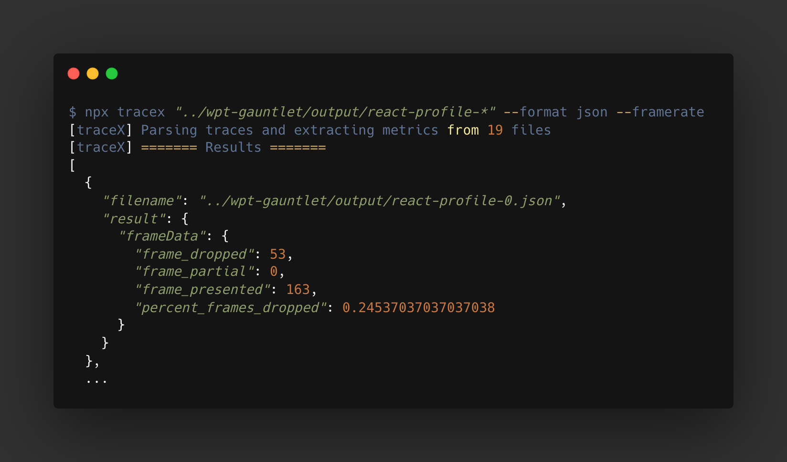
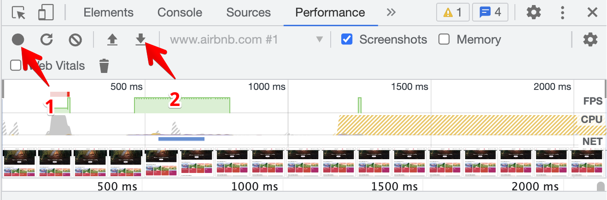
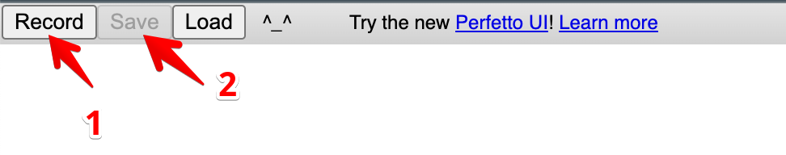

# tracex

A parallel, pluggable utility to extract metric from browser traces.



## Features

- **Fast**: tracex extracts metrics from large numbers of traces in parallel, and handles large traces gracefully through streaming.
- **Pluggable**: tracex allows you to create your own specific metrics, and tweak their definitions. This allows you to experiment with custom metrics, or create your own.
- **Graceful errors**: trace handles errors gracefully, allowing you to ignore or fix problems in individual trace files or traces.

**✨ Use with [wpt-gauntlet](https://github.com/jpnelson/wpt-gauntlet) for an end-to-end benchmarking solution!**

## Usage

To get started, you can install tracex locally, or run it using npx:

$ npx tracex --help

tracex can be run on a single profile, or a collection of profiles.

For example, to collect metrics from a collection of traces, we specify the file(s) (via a glob pattern) and the metrics we wish to collect:

```sh
$ npx tracex "../wpt-gauntlet/output/react-profile-*" --functions "1"

[traceX] Parsing traces and extracting metrics from 19 files
[traceX] ======= Results =======
fileName,function.1:timeTotal,function.1:samplesPresent,function.1:sampleTotal
../wpt-gauntlet/output/react-profile-0.json,17296,51,70954
../wpt-gauntlet/output/react-profile-10.json,17102,69,68011
../wpt-gauntlet/output/react-profile-11.json,17102,69,68011
../wpt-gauntlet/output/react-profile-12.json,11738,29,66865

...
```

To see a list of built-in metrics and how they can be configured, run `npx tracex --help`.

## Collecting the traces

To use tracex, you must also have a trace, or a collection of traces. This can be done in several ways:

**Using a tool like webpagetest, or [wpt-gauntlet](https://github.com/jpnelson/wpt-gauntlet)**

See [wpt-gauntlet](https://github.com/jpnelson/wpt-gauntlet) for more details on how to use wpt-gauntlet to collect a large number of traces in an automated way

**Profiling chrome using the performace devtools**



**Profiling chrome using `chrome://tracing` directly**

Visiting `chrome://tracing` in Chrome allows you to customize which categories of metrics are recorded in your trace. This gives you a lot more ability to create and specify custom metrics:


The tracing categories relied upon for the built in metrics are:

- urls, functions: `['disabled-by-default-v8.cpu_profiler']`
- framerate: `['cc', 'benchmark']`

See [here](https://chromium.googlesource.com/chromium/src/+/refs/heads/main/base/trace_event/builtin_categories.h) for a list of categories.

## Built in metrics

- **--functions "foo"**: count the number of samples, and the duration of time spent inside functions that match the name of the given parameter. Can be used to profile specific functions over a large collection of traces.
- **--urls "bar"**: count the number of samples and total time spent inside functions belonging to a particular URL pattern. For example, if your framework was in a bundle named `framework.js`, `--urls "framework"` would count time spent inside this framework.
- **--framerate**: collect framerate metrics sampled in this profile.

## Custom metrics

Custom metrics can be created using plugins. This can be configured with the `--plugins` argument on the command line:

```sh
$ npx tracex ~/Downloads/Profile-20220508T213500.json --plugins ./plugin/example.plugin.js

[traceX] Parsing traces and extracting metrics from 1 files
[traceX] ======= Results =======
fileName,example:events
/Users/josh_nelson/Downloads/Profile-20220508T213500.json,7734
```

A plugin consists of a module with a default export, with the following fields:

```js
export default {
  // The name of the plugin
  name: "example",
  // A function that creates the plugin
  plugin: function examplePlugin(config, log) {
    const example = {
      events: 0,
    };

    // Returns the plugin itself
    return {
      // `preExtract` runs first over every event in the trace.
      // This can be used for any pre-computation or setup necessary.
      preExtract: (event) => {},
      // `extract` runs afterwards, again over every event in the trace. Most work should be done here.
      extract: () => {
        // See docs.google.com/document/d/1CvAClvFfyA5R-PhYUmn5OOQtYMH4h6I0nSsKchNAySU/edit for documentation on the trace event format.
        example.events++;
      },
      // `report` is used to collect results from the plugin. Metrics have a key:subkey format, so ensure that metrics are namespaced in the object under a specific key.
      report: () => {
        return {
          example,
        };
      },
    };
  },
};
```

See [example.plugin.js](./plugin/example.plugin.js) for an example plugin.
